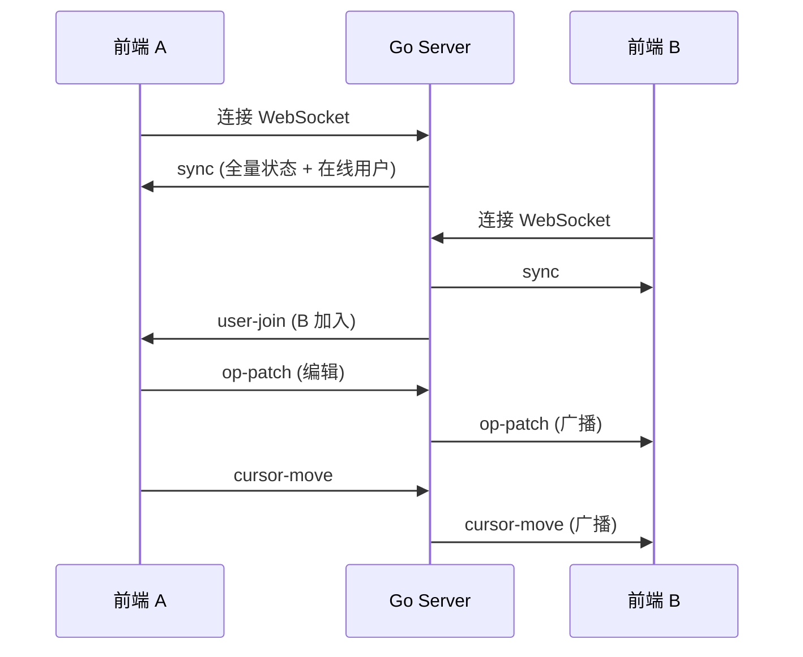

# 前端对接指南

本文档面向前端开发者，详细说明如何与 Go 后端 API 进行集成。

---

## 目录

1. [快速开始](#快速开始)
2. [认证集成 (Clerk)](#认证集成-clerk)
3. [REST API 参考](#rest-api-参考)
4. [WebSocket 协同编辑](#websocket-协同编辑)
5. [错误处理规范](#错误处理规范)
6. [前端实现建议](#前端实现建议)

---

## 快速开始

### 后端服务地址

| 环境     | 地址                              |
| -------- | --------------------------------- |
| 本地开发 | `http://localhost:8080`           |
| 生产环境 | `https://your-domain.railway.app` |

### 核心端点一览

| 端点                 | 方法      | 用途     | 认证方式       |
| -------------------- | --------- | -------- | -------------- |
| `/health`            | GET       | 健康检查 | 无需认证       |
| `/api/pages/:pageId` | GET       | 获取页面 | Bearer Token   |
| `/api/pages`         | POST      | 创建页面 | Bearer Token   |
| `/api/pages/:pageId` | DELETE    | 删除页面 | Bearer Token   |
| `/ws`                | WebSocket | 协同编辑 | URL 参数 Token |

---

## 认证集成 (Clerk)

后端使用 [Clerk](https://clerk.com) 进行身份认证。前端需要：

### 1. 安装 Clerk SDK

```bash
npm install @clerk/clerk-react
# 或
pnpm add @clerk/clerk-react
```

### 2. 配置 ClerkProvider

```tsx
// src/main.tsx 或 App.tsx
import { ClerkProvider } from "@clerk/clerk-react";

const PUBLISHABLE_KEY = import.meta.env.VITE_CLERK_PUBLISHABLE_KEY;

function App() {
  return (
    <ClerkProvider publishableKey={PUBLISHABLE_KEY}>
      {/* 你的应用 */}
    </ClerkProvider>
  );
}
```

### 3. 添加登录/登出按钮

```tsx
import { SignInButton, SignOutButton, useUser } from "@clerk/clerk-react";

function Header() {
  const { isSignedIn, user } = useUser();

  return (
    <header>
      {isSignedIn ? (
        <>
          <span>欢迎，{user.firstName}</span>
          <SignOutButton />
        </>
      ) : (
        <SignInButton mode="modal" />
      )}
    </header>
  );
}
```

### 4. 获取 JWT Token（用于 API 请求）

```tsx
import { useAuth } from "@clerk/clerk-react";

function useApiClient() {
  const { getToken } = useAuth();

  const apiRequest = async (url: string, options: RequestInit = {}) => {
    const token = await getToken();

    return fetch(url, {
      ...options,
      headers: {
        ...options.headers,
        Authorization: `Bearer ${token}`,
        "Content-Type": "application/json",
      },
    });
  };

  return { apiRequest };
}
```

> [!IMPORTANT]
> 每次 API 请求都需要调用 `getToken()` 获取最新的 JWT Token，因为 Token 有过期时间。

---

## REST API 参考

### 获取页面

```http
GET /api/pages/:pageId
Authorization: Bearer <token>
```

**响应 (200 OK)**

```json
{
  "pageId": "page_abc123",
  "schema": {
    "components": [...],
    "layout": {...}
  },
  "version": 42
}
```

**错误响应**

| 状态码 | 说明             |
| ------ | ---------------- |
| 401    | Token 无效或缺失 |
| 404    | 页面不存在       |

---

### 创建页面

```http
POST /api/pages
Authorization: Bearer <token>
Content-Type: application/json

{
  "pageId": "page_abc123"
}
```

**响应 (201 Created)**

```json
{
  "pageId": "page_abc123",
  "schema": {},
  "version": 1
}
```

**错误响应**

| 状态码 | 说明        |
| ------ | ----------- |
| 400    | pageId 为空 |
| 401    | Token 无效  |
| 409    | 页面已存在  |

---

### 删除页面

```http
DELETE /api/pages/:pageId
Authorization: Bearer <token>
```

> [!CAUTION]
> 这是危险操作！会强制关闭协同编辑房间，踢出所有在线用户。

**响应 (200 OK)**

```json
{
  "message": "页面已删除",
  "pageId": "page_abc123"
}
```

**错误响应**

| 状态码 | 说明                         |
| ------ | ---------------------------- |
| 401    | Token 无效                   |
| 403    | 无权限删除此页面（非创建者） |
| 404    | 页面不存在                   |

---

## WebSocket 协同编辑

### 连接方式

WebSocket 不支持自定义 Header，因此 Token 需要通过 URL 参数传递：

```typescript
const token = await getToken();
const ws = new WebSocket(
  `wss://your-domain/ws?pageId=${pageId}&token=${token}`
);
```

### 消息格式

所有 WebSocket 消息使用统一的 JSON 格式：

```typescript
interface WSMessage {
  type: MessageType; // 消息类型
  senderId: string; // 发送者 ID
  payload: any; // 消息内容
  ts: number; // 时间戳 (Unix ms)
}

type MessageType =
  | "op-patch" // 增量编辑补丁
  | "cursor-move" // 光标位置同步
  | "user-join" // 用户加入房间
  | "user-leave" // 用户离开房间
  | "sync" // 全量同步（新用户加入时接收）
  | "ack" // 服务器确认
  | "error"; // 错误消息
```

### 消息流程



### 消息类型详解

#### 1. `sync` - 全量同步

**接收时机**：连接成功后服务器自动发送

```json
{
  "type": "sync",
  "senderId": "server",
  "payload": {
    "schema": {
      /* 完整页面 Schema */
    },
    "version": 42,
    "users": [
      { "userId": "user_123", "userName": "张三", "color": "#FF6B6B" },
      { "userId": "user_456", "userName": "李四", "color": "#4ECDC4" }
    ]
  },
  "ts": 1702345678000
}
```

**前端处理**：

```typescript
ws.onmessage = (event) => {
  const msg = JSON.parse(event.data);

  if (msg.type === "sync") {
    // 初始化编辑器状态
    setSchema(msg.payload.schema);
    setVersion(msg.payload.version);
    setOnlineUsers(msg.payload.users);
  }
};
```

#### 2. `op-patch` - 增量编辑

**发送格式**：

```json
{
  "type": "op-patch",
  "senderId": "user_123",
  "payload": [
    { "op": "replace", "path": "/components/0/props/text", "value": "新标题" }
  ],
  "ts": 1702345678000
}
```

> [!NOTE]
> Payload 遵循 [RFC 6902 JSON Patch](https://datatracker.ietf.org/doc/html/rfc6902) 规范。
> 支持的操作：`add`, `remove`, `replace`, `move`, `copy`

**前端发送示例**：

```typescript
function sendPatch(patches: Operation[]) {
  ws.send(
    JSON.stringify({
      type: "op-patch",
      senderId: userId,
      payload: patches,
      ts: Date.now(),
    })
  );
}
```

#### 3. `cursor-move` - 光标同步

**发送格式**：

```json
{
  "type": "cursor-move",
  "senderId": "user_123",
  "payload": {
    "componentId": "comp_abc",
    "position": { "x": 100, "y": 200 }
  },
  "ts": 1702345678000
}
```

#### 4. `user-join` / `user-leave` - 用户进出

**接收格式**：

```json
{
  "type": "user-join",
  "senderId": "user_456",
  "payload": {
    "userId": "user_456",
    "userName": "李四",
    "color": "#4ECDC4"
  },
  "ts": 1702345678000
}
```

#### 5. `error` - 错误消息

**接收格式**：

```json
{
  "type": "error",
  "senderId": "server",
  "payload": {
    "code": "VERSION_CONFLICT",
    "message": "版本冲突，请刷新页面"
  },
  "ts": 1702345678000
}
```

---

## 错误处理规范

### HTTP 错误码

| 状态码 | 含义           | 前端处理建议            |
| ------ | -------------- | ----------------------- |
| 400    | 参数错误       | 检查请求参数            |
| 401    | 未认证         | 跳转登录页              |
| 403    | 无权限         | 提示用户无权限          |
| 404    | 资源不存在     | 提示页面不存在          |
| 409    | 资源冲突       | 资源已存在，提示用户    |
| 503    | 服务暂时不可用 | 按 `Retry-After` 头重试 |
| 500    | 服务器错误     | 显示通用错误提示        |

### WebSocket 错误码

| 错误码             | 含义           | 前端处理建议     |
| ------------------ | -------------- | ---------------- |
| `VERSION_CONFLICT` | 版本冲突       | 重新拉取最新状态 |
| `PATCH_INVALID`    | Patch 格式错误 | 检查发送的 Patch |
| `PATCH_FAILED`     | Patch 应用失败 | 重新拉取状态     |
| `ROOM_NOT_FOUND`   | 房间不存在     | 重新创建连接     |
| `UNAUTHORIZED`     | 未授权         | 跳转登录页       |
| `PAGE_DELETED`     | 页面已被删除   | 提示用户并跳转   |
| `INTERNAL_ERROR`   | 服务器错误     | 显示错误提示     |

---

## 前端实现建议

### 1. Patch 防抖

频繁发送 Patch 会增加服务器压力。建议使用防抖：

```typescript
import { useMemo } from "react";
import { debounce } from "lodash-es";

function useWebSocket(pageId: string) {
  const ws = useRef<WebSocket | null>(null);

  // 防抖发送 Patch，100-200ms 是推荐值
  const sendPatch = useMemo(
    () =>
      debounce((patches: Operation[]) => {
        if (ws.current?.readyState === WebSocket.OPEN) {
          ws.current.send(
            JSON.stringify({
              type: "op-patch",
              senderId: userId,
              payload: patches,
              ts: Date.now(),
            })
          );
        }
      }, 150),
    [userId]
  );

  return { sendPatch };
}
```

### 2. Patch 批量合并

如果短时间内产生多个 Patch，可以合并后一起发送：

```typescript
const patchQueue = useRef<Operation[]>([]);

const queuePatch = (patch: Operation) => {
  patchQueue.current.push(patch);
  flushPatches();
};

const flushPatches = useMemo(
  () =>
    debounce(() => {
      if (patchQueue.current.length > 0) {
        sendPatch(patchQueue.current);
        patchQueue.current = [];
      }
    }, 150),
  []
);
```

### 3. WebSocket 自动重连

```typescript
function useWebSocketWithReconnect(pageId: string) {
  const [isConnected, setIsConnected] = useState(false);
  const reconnectAttempts = useRef(0);
  const maxReconnectAttempts = 5;

  const connect = useCallback(async () => {
    const token = await getToken();
    const ws = new WebSocket(
      `wss://your-domain/ws?pageId=${pageId}&token=${token}`
    );

    ws.onopen = () => {
      setIsConnected(true);
      reconnectAttempts.current = 0;
    };

    ws.onclose = () => {
      setIsConnected(false);

      // 指数退避重连
      if (reconnectAttempts.current < maxReconnectAttempts) {
        const delay = Math.min(1000 * 2 ** reconnectAttempts.current, 30000);
        reconnectAttempts.current++;
        setTimeout(connect, delay);
      }
    };

    ws.onerror = (error) => {
      console.error("WebSocket error:", error);
    };

    return ws;
  }, [pageId]);

  useEffect(() => {
    const ws = connect();
    return () => ws?.close();
  }, [connect]);

  return { isConnected };
}
```

### 4. 协同编辑 UI 建议

```tsx
// 显示在线用户头像
function OnlineUsers({ users }: { users: UserInfo[] }) {
  return (
    <div className="flex -space-x-2">
      {users.map((user) => (
        <div
          key={user.userId}
          className="w-8 h-8 rounded-full border-2"
          style={{ borderColor: user.color, backgroundColor: user.color }}
          title={user.userName}
        >
          {user.userName[0]}
        </div>
      ))}
    </div>
  );
}
```

### 5. 光标同步 UI

```tsx
// 显示其他用户的光标位置
function CollaboratorCursor({
  user,
  position,
}: {
  user: UserInfo;
  position: Position;
}) {
  return (
    <div
      className="absolute pointer-events-none"
      style={{ left: position.x, top: position.y }}
    >
      <div
        className="w-4 h-4 rounded-full"
        style={{ backgroundColor: user.color }}
      />
      <span
        className="text-xs px-1 rounded ml-1"
        style={{ backgroundColor: user.color }}
      >
        {user.userName}
      </span>
    </div>
  );
}
```

### 6. 完整的 Hook 示例

```typescript
// hooks/useCollaboration.ts
import { useEffect, useRef, useState, useCallback, useMemo } from "react";
import { useAuth } from "@clerk/clerk-react";
import { debounce } from "lodash-es";
import type { Operation } from "fast-json-patch";

interface UserInfo {
  userId: string;
  userName: string;
  color: string;
}

interface CollaborationState {
  isConnected: boolean;
  onlineUsers: UserInfo[];
  sendPatch: (patches: Operation[]) => void;
  sendCursorMove: (
    componentId: string,
    position: { x: number; y: number }
  ) => void;
}

export function useCollaboration(pageId: string): CollaborationState {
  const { getToken, userId } = useAuth();
  const wsRef = useRef<WebSocket | null>(null);
  const [isConnected, setIsConnected] = useState(false);
  const [onlineUsers, setOnlineUsers] = useState<UserInfo[]>([]);

  // 连接 WebSocket
  useEffect(() => {
    let ws: WebSocket;
    let reconnectTimeout: NodeJS.Timeout;

    const connect = async () => {
      const token = await getToken();
      ws = new WebSocket(
        `${import.meta.env.VITE_WS_URL}/ws?pageId=${pageId}&token=${token}`
      );

      ws.onopen = () => {
        wsRef.current = ws;
        setIsConnected(true);
      };

      ws.onmessage = (event) => {
        const msg = JSON.parse(event.data);

        switch (msg.type) {
          case "sync":
            // 全量同步
            setOnlineUsers(msg.payload.users);
            // TODO: 更新编辑器状态
            break;
          case "user-join":
            setOnlineUsers((prev) => [...prev, msg.payload]);
            break;
          case "user-leave":
            setOnlineUsers((prev) =>
              prev.filter((u) => u.userId !== msg.senderId)
            );
            break;
          case "op-patch":
            // TODO: 应用远程 Patch
            break;
          case "error":
            console.error("WS Error:", msg.payload);
            break;
        }
      };

      ws.onclose = () => {
        setIsConnected(false);
        // 3 秒后重连
        reconnectTimeout = setTimeout(connect, 3000);
      };
    };

    connect();

    return () => {
      clearTimeout(reconnectTimeout);
      ws?.close();
    };
  }, [pageId, getToken]);

  // 防抖发送 Patch
  const sendPatch = useMemo(
    () =>
      debounce((patches: Operation[]) => {
        if (wsRef.current?.readyState === WebSocket.OPEN) {
          wsRef.current.send(
            JSON.stringify({
              type: "op-patch",
              senderId: userId,
              payload: patches,
              ts: Date.now(),
            })
          );
        }
      }, 150),
    [userId]
  );

  // 发送光标位置
  const sendCursorMove = useCallback(
    (componentId: string, position: { x: number; y: number }) => {
      if (wsRef.current?.readyState === WebSocket.OPEN) {
        wsRef.current.send(
          JSON.stringify({
            type: "cursor-move",
            senderId: userId,
            payload: { componentId, position },
            ts: Date.now(),
          })
        );
      }
    },
    [userId]
  );

  return {
    isConnected,
    onlineUsers,
    sendPatch,
    sendCursorMove,
  };
}
```

---

## 环境变量

前端需要配置以下环境变量：

```env
# Clerk 配置
VITE_CLERK_PUBLISHABLE_KEY=pk_test_xxx

# API 地址
VITE_API_URL=http://localhost:8080
VITE_WS_URL=ws://localhost:8080
```

---

## 检查清单

前端对接前，请确认：

- [ ] 已配置 Clerk 并能正常登录/登出
- [ ] 已实现 `getToken()` 获取 JWT
- [ ] 所有 API 请求都带有 `Authorization: Bearer <token>` 头
- [ ] WebSocket 连接时通过 URL 参数传递 Token
- [ ] 已实现 Patch 发送的防抖（推荐 100-200ms）
- [ ] 已实现 WebSocket 断线自动重连
- [ ] 已处理所有错误码，特别是 401 跳转登录
