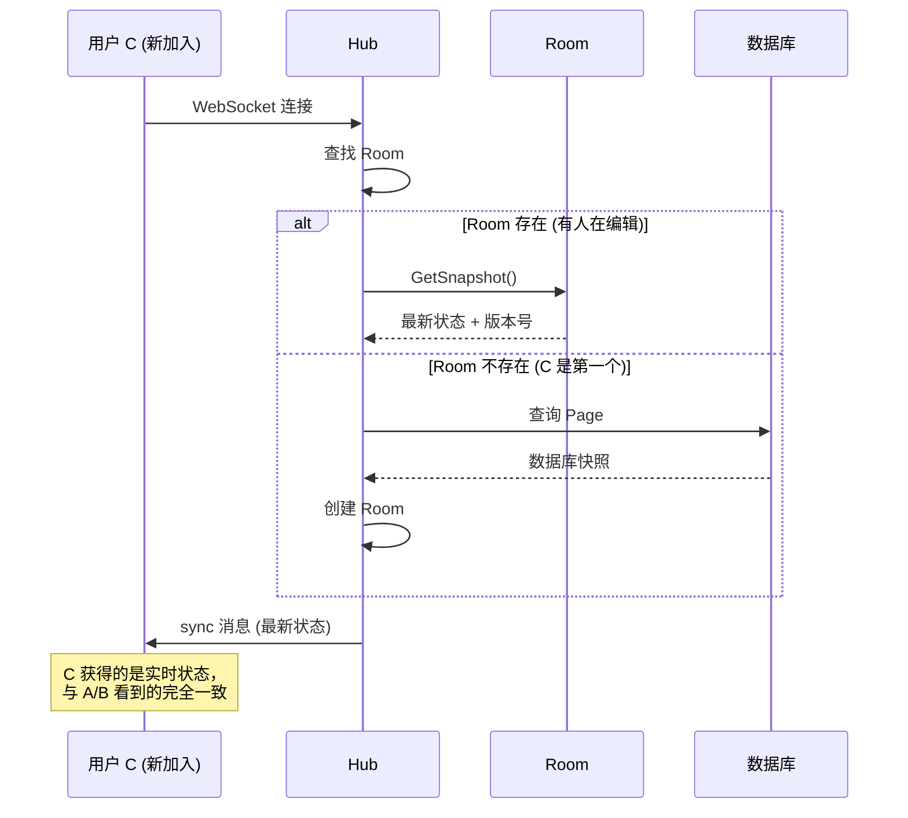
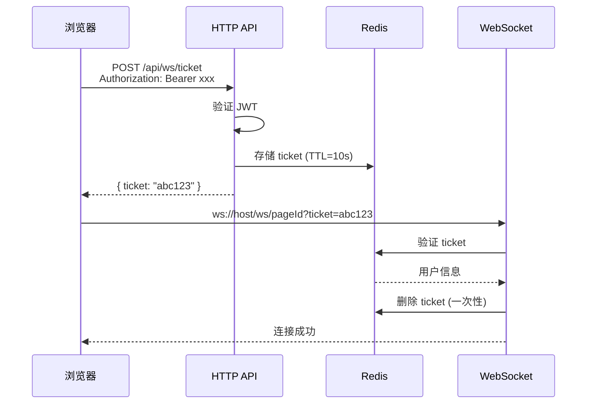

# Go 后端实时协同开发指南 (v3.0)

> **v3.0 重大更新**: 根据架构评审反馈，修正了数据结构设计、状态同步机制和安全鉴权方案。
>
> 本文档基于您的低代码编辑器前端代码库，专门为 **Zustand + Immer + JSON Patch (RFC 6902)** 技术栈设计的 Go 后端架构指南。

## 目录

1. [核心数据结构对应](#一-核心数据结构对应) ⚠️ **v3.0 重写**
2. [后端 Patch 应用逻辑](#二-后端-patch-应用逻辑) 🆕 **v3.0 新增**
3. [WebSocket 核心实现](#三-websocket-核心实现) ⚠️ **v3.0 重写**
4. [安全的 WebSocket 鉴权](#四-安全的-websocket-鉴权) 🆕 **v3.0 新增**
5. [前后端对接方案](#五-前后端对接方案)
6. [Gin API 路由设计](#六-gin-api-路由设计)
7. [并发处理深度解析](#七-并发处理深度解析)

---

## 一、核心数据结构对应

### 1.1 前端 Schema 结构分析

根据您的 `src/editor/interface.ts` 和 `src/editor/stores/components.tsx`，前端使用 **范式化 Map 结构**：

```typescript
// 前端 Store State (components.tsx L25-36)
interface State {
  components: Record<number, Component>; // 扁平化 Map
  rootId: number; // 根节点 ID
}

// 单个组件节点 (interface.ts L15-25)
interface Component {
  id: number;
  name: string;
  props: any;
  desc: string;
  parentId?: number | null;
  children?: number[]; // 只存子节点 ID
  styles?: CSSProperties;
}
```

### 1.2 Go 后端数据结构定义 (v3.0 重写)

> [!CAUTION]
> **v2.0 的致命问题**
>
> 使用 `map[string]interface{}` 存储 Props/Styles 会导致：
>
> 1. **性能问题**: Go 需要反射解析嵌套结构，开销极大
> 2. **Patch 应用困难**: 无法用标准库处理 `/props/style/color` 这样的路径
>
> **v3.0 核心改变**: 后端 **不解析** 业务字段，只 **存储和转发** JSON 字节流。

```go
// internal/model/schema.go

package model

import (
    "encoding/json"
    "time"
)

// Component 对应前端的 Component interface
// ⚠️ 关键变化：使用 json.RawMessage 存储 Props 和 Styles
type Component struct {
    ID       int             `json:"id"`
    Name     string          `json:"name"`
    Desc     string          `json:"desc"`
    ParentID *int            `json:"parentId,omitempty"`
    Children []int           `json:"children,omitempty"`

    // ✅ json.RawMessage: Go 不解析内部结构，直接当字节数组存取
    // 性能好 + 完美支持任意嵌套结构
    Props  json.RawMessage `json:"props,omitempty"`
    Styles json.RawMessage `json:"styles,omitempty"`
}

// PageSchema 对应前端的完整页面快照
type PageSchema struct {
    RootID     int                  `json:"rootId"`
    Components map[string]Component `json:"components"`
}

// Page 数据库模型（GORM）
type Page struct {
    ID        uint      `gorm:"primaryKey"`
    PageID    string    `gorm:"uniqueIndex;size:64"`
    Schema    string    `gorm:"type:jsonb"`           // PostgreSQL JSONB
    Version   int64     `gorm:"default:0"`            // 乐观锁版本号
    CreatedAt time.Time
    UpdatedAt time.Time
}
```

> [!TIP]
> **json.RawMessage 的优势**
>
> ```go
> // 前端传来的 Props 可能是任意结构
> props := `{"style":{"color":"red","fontSize":14},"onClick":{"type":"navigate"}}`
>
> // ❌ map[string]interface{} 需要反射解析每一层
> // ✅ json.RawMessage 直接存储字节，零解析开销
> component.Props = json.RawMessage(props)
> ```

---

## 二、后端 Patch 应用逻辑 (v3.0 新增)

> [!IMPORTANT]
> **v2.0 的致命遗漏：新用户加入问题**
>
> 用户 A 和 B 已经产生了 500 个 Patch，此时用户 C 加入房间：
>
> - ❌ 方案 A: 发送数据库老版本 → C 看到的与 A/B 不一致
> - ❌ 方案 B: 发送老版本 + 500 个 Patch → C 的浏览器卡死
> - ✅ **方案 C**: 后端内存维护"最新快照"，直接发给 C

### 2.1 核心依赖：json-patch 库

```bash
go get github.com/evanphx/json-patch/v5
```

**这个库能做什么？**

```go
import jsonpatch "github.com/evanphx/json-patch/v5"

// 原始 JSON (内存中的最新状态)
original := []byte(`{"components":{"1":{"id":1,"name":"Page","props":{"title":"Hello"}}}}`)

// 前端发来的 Patch (RFC 6902 格式)
patchBytes := []byte(`[
    {"op":"replace","path":"/components/1/props/title","value":"World"}
]`)

// 解析并应用 Patch
patch, _ := jsonpatch.DecodePatch(patchBytes)
modified, err := patch.Apply(original)

// modified = `{"components":{"1":{"id":1,"name":"Page","props":{"title":"World"}}}}`
```

### 2.2 Room 结构体：维护实时状态

> [!CAUTION]
> **生产环境警告 #1：数据持久化的"真空期"风险**
>
> 当前逻辑是"房间没人时才保存到数据库"。如果有人挂机不关浏览器，数据就一直只在内存里。
>
> **灾难场景**: 服务器崩溃/重启 → 这几天产生的所有协同修改全部丢失！
>
> **解决方案**: 定时刷盘 + 阈值刷盘（每 30 秒或每 50 个 Patch 刷一次）

```go
// internal/ws/room.go

package ws

import (
    "fmt"
    "log"
    "sync"
    "time"

    jsonpatch "github.com/evanphx/json-patch/v5"
)

// Room 代表一个协同编辑房间
// 核心职责：维护最新的页面状态快照
type Room struct {
    ID           string
    CurrentState []byte            // 内存中的最新状态
    Version      int64             // 乐观锁版本号
    Clients      map[*Client]bool
    mu           sync.RWMutex
    LastActive   time.Time

    // ✅ v3.1 新增：定时刷盘机制
    lastPersistedVersion int64         // 上次持久化的版本
    dirtyPatchCount      int           // 脏数据计数器
    flushTicker          *time.Ticker  // 定时刷盘
    stopFlush            chan struct{} // 停止信号
    pageService          PageService   // 数据库服务
}

// 刷盘配置
const (
    FlushInterval  = 30 * time.Second  // 每 30 秒刷一次
    FlushThreshold = 50                // 每 50 个 Patch 刷一次
)

// NewRoom 创建新房间 + 启动定时刷盘
func NewRoom(id string, initialState []byte, pageService PageService) *Room {
    r := &Room{
        ID:                   id,
        CurrentState:         initialState,
        Version:              1,
        lastPersistedVersion: 1,
        Clients:              make(map[*Client]bool),
        LastActive:           time.Now(),
        flushTicker:          time.NewTicker(FlushInterval),
        stopFlush:            make(chan struct{}),
        pageService:          pageService,
    }

    // 启动定时刷盘 Goroutine
    go r.flushLoop()

    return r
}

// flushLoop 定时刷盘循环
func (r *Room) flushLoop() {
    for {
        select {
        case <-r.flushTicker.C:
            r.flushToDB("定时")
        case <-r.stopFlush:
            r.flushToDB("销毁前")
            return
        }
    }
}

// flushToDB 将当前状态刷写到数据库
func (r *Room) flushToDB(reason string) {
    r.mu.RLock()
    if r.Version == r.lastPersistedVersion {
        r.mu.RUnlock()
        return // 没有新修改
    }

    snapshot := make([]byte, len(r.CurrentState))
    copy(snapshot, r.CurrentState)
    version := r.Version
    r.mu.RUnlock()

    // 异步写入（不持有锁）
    if err := r.pageService.SavePageState(r.ID, snapshot, version); err != nil {
        log.Printf("[Room %s] ⚠️ %s刷盘失败: %v", r.ID, reason, err)
        return
    }

    r.mu.Lock()
    r.lastPersistedVersion = version
    r.dirtyPatchCount = 0
    r.mu.Unlock()

    log.Printf("[Room %s] ✅ %s刷盘, 版本: %d", r.ID, reason, version)
}

// Stop 停止定时刷盘 (房间销毁时调用)
func (r *Room) Stop() {
    r.flushTicker.Stop()
    close(r.stopFlush)
}

// ApplyPatch 应用 Patch 并更新内存状态
func (r *Room) ApplyPatch(patchBytes []byte) error {
    r.mu.Lock()
    defer r.mu.Unlock()

    patch, err := jsonpatch.DecodePatch(patchBytes)
    if err != nil {
        return fmt.Errorf("patch 解析失败: %w", err)
    }

    modified, err := patch.Apply(r.CurrentState)
    if err != nil {
        return fmt.Errorf("patch 应用失败: %w", err)
    }

    r.CurrentState = modified
    r.Version++
    r.LastActive = time.Now()
    r.dirtyPatchCount++

    // ✅ 超过阈值立即触发异步刷盘
    if r.dirtyPatchCount >= FlushThreshold {
        go r.flushToDB("阈值触发")
    }

    return nil
}

// GetSnapshot 获取当前快照（用于新用户加入）
func (r *Room) GetSnapshot() ([]byte, int64) {
    r.mu.RLock()
    defer r.mu.RUnlock()

    snapshot := make([]byte, len(r.CurrentState))
    copy(snapshot, r.CurrentState)

    return snapshot, r.Version
}
```

### 2.3 新用户加入流程



### 2.4 Patch 处理完整流程

```go
// client.go 中的 handleOpPatch 重写

func (c *Client) handleOpPatch(message []byte) {
    var wsMsg WSMessage
    json.Unmarshal(message, &wsMsg)

    var patchPayload struct {
        Patches json.RawMessage `json:"patches"`  // RFC 6902 格式的 Patch 数组
        Version int64           `json:"version"`
    }
    json.Unmarshal(wsMsg.Payload, &patchPayload)

    // 1. 获取房间
    room := c.Hub.GetRoom(c.RoomID)
    if room == nil {
        return
    }

    // 2. 版本冲突检测（乐观锁）
    if patchPayload.Version != room.Version {
        // 版本不一致，拒绝或尝试合并
        c.sendError("版本冲突，请刷新")
        return
    }

    // 3. ✅ 核心：应用 Patch 到内存状态
    if err := room.ApplyPatch(patchPayload.Patches); err != nil {
        log.Printf("[Client] Patch 应用失败: %v", err)
        c.sendError(err.Error())
        return
    }

    // 4. 广播给房间内其他人
    c.Hub.Broadcast(c.RoomID, message, c)

    log.Printf("[Client] ✅ 用户 [%s] Patch 已应用，新版本: %d",
        c.UserInfo.UserName, room.Version)
}
```

---

## 三、WebSocket 核心实现 (v3.0 重写)

### 3.1 消息协议定义

```go
// internal/ws/message.go

package ws

import "encoding/json"

// MessageType 消息类型枚举
type MessageType string

const (
    // 核心协同消息
    TypeOpPatch    MessageType = "op-patch"      // 增量编辑补丁
    TypeCursorMove MessageType = "cursor-move"   // 光标位置同步

    // 系统消息
    TypeUserJoin   MessageType = "user-join"     // 用户加入房间
    TypeUserLeave  MessageType = "user-leave"    // 用户离开房间
    TypeSync       MessageType = "sync"          // 全量同步（用于新用户加入）
    TypeAck        MessageType = "ack"           // 确认消息
    TypeError      MessageType = "error"         // 错误消息
)

// WSMessage 统一的 WebSocket 消息结构
type WSMessage struct {
    Type      MessageType     `json:"type"`
    SenderID  string          `json:"senderId"`
    Payload   json.RawMessage `json:"payload"`
    Timestamp int64           `json:"ts"`
}

// SyncPayload sync 消息的 payload（新用户加入时发送）
type SyncPayload struct {
    Schema  json.RawMessage `json:"schema"`  // 最新的完整 Schema
    Version int64           `json:"version"` // 当前版本号
    Users   []UserInfo      `json:"users"`   // 房间内其他用户
}

// UserInfo 用户基础信息
type UserInfo struct {
    UserID   string `json:"userId"`
    UserName string `json:"userName"`
    Color    string `json:"color,omitempty"`
}
```

### 3.2 Hub 房间管理器 (v3.0 重写)

> [!WARNING]
> **生产环境警告 #2：Hub 的单点压力**
>
> 当前 Hub 是单 Goroutine 处理所有 `register/unregister/broadcast` 事件。
>
> - **现状**: 几百个并发连接完全没问题
> - **未来风险**: 10,000+ 并发连接时，Hub 的 `select` 循环会成为瓶颈
>
> **解决方案 (未来)**: Sharded Hub（分片 Hub）
>
> - `Hub[0]` 管理房间 ID 尾号为 0 的房间
> - `Hub[1]` 管理尾号为 1 的房间
> - 以此类推...
>
> **当前阶段**: 保持简单，现有架构足够支撑 MVP。

```go
// internal/ws/hub.go

package ws

import (
    "encoding/json"
    "log"
    "time"
)

// Hub 维护所有活跃房间和客户端连接
type Hub struct {
    // ✅ v3.0: 房间映射改为 map[string]*Room
    // 每个 Room 维护自己的 CurrentState
    rooms map[string]*Room

    // Channel 事件通道
    register   chan *Client
    unregister chan *Client
    broadcast  chan *BroadcastMessage

    // 数据库服务（用于加载初始状态）
    pageService PageService
}

// PageService 接口，用于数据库操作
type PageService interface {
    GetPageState(pageID string) ([]byte, int64, error)
    SavePageState(pageID string, state []byte, version int64) error
}

// NewHub 创建 Hub 实例
func NewHub(pageService PageService) *Hub {
    return &Hub{
        rooms:       make(map[string]*Room),
        register:    make(chan *Client),
        unregister:  make(chan *Client),
        broadcast:   make(chan *BroadcastMessage, 256),
        pageService: pageService,
    }
}

// Run 启动 Hub 事件循环
func (h *Hub) Run() {
    log.Println("[Hub] 🚀 Hub 事件循环已启动")

    for {
        select {
        case client := <-h.register:
            h.handleRegister(client)

        case client := <-h.unregister:
            h.handleUnregister(client)

        case msg := <-h.broadcast:
            h.handleBroadcast(msg)
        }
    }
}

// handleRegister 处理客户端加入 (v3.0 重写)
func (h *Hub) handleRegister(client *Client) {
    roomID := client.RoomID

    room, exists := h.rooms[roomID]
    if !exists {
        // 房间不存在，从数据库加载初始状态
        initialState, version, err := h.pageService.GetPageState(roomID)
        if err != nil {
            log.Printf("[Hub] ⚠️ 加载页面失败: %v", err)
            // 使用空状态
            initialState = []byte(`{"rootId":1,"components":{}}`)
            version = 1
        }

        room = NewRoom(roomID, initialState)
        room.Version = version
        h.rooms[roomID] = room
        log.Printf("[Hub] 🏠 创建新房间: %s", roomID)
    }

    // 将客户端加入房间
    room.Clients[client] = true
    client.Room = room  // 客户端持有 Room 引用

    log.Printf("[Hub] ✅ 用户 [%s] 加入房间 [%s]，当前人数: %d",
        client.UserInfo.UserName, roomID, len(room.Clients))

    // ✅ 核心：发送最新快照给新用户
    h.sendSyncMessage(client, room)

    // 广播用户加入消息
    h.broadcastUserJoin(client, room)
}

// sendSyncMessage 发送全量同步消息给新用户
func (h *Hub) sendSyncMessage(client *Client, room *Room) {
    snapshot, version := room.GetSnapshot()

    // 收集房间内其他用户信息
    users := make([]UserInfo, 0)
    for c := range room.Clients {
        if c != client {
            users = append(users, c.UserInfo)
        }
    }

    syncPayload := SyncPayload{
        Schema:  snapshot,
        Version: version,
        Users:   users,
    }

    payload, _ := json.Marshal(syncPayload)
    msg := WSMessage{
        Type:      TypeSync,
        SenderID:  "server",
        Payload:   payload,
        Timestamp: time.Now().UnixMilli(),
    }

    data, _ := json.Marshal(msg)
    client.send <- data

    log.Printf("[Hub] 📤 已发送 Sync 消息给 [%s], 版本: %d",
        client.UserInfo.UserName, version)
}

// handleUnregister 处理客户端离开
func (h *Hub) handleUnregister(client *Client) {
    room := client.Room
    if room == nil {
        return
    }

    if _, ok := room.Clients[client]; ok {
        delete(room.Clients, client)
        close(client.send)

        log.Printf("[Hub] 🚪 用户 [%s] 离开房间 [%s]",
            client.UserInfo.UserName, room.ID)

        h.broadcastUserLeave(client, room)

        // 房间空了，保存状态到数据库并清理
        if len(room.Clients) == 0 {
            snapshot, version := room.GetSnapshot()
            if err := h.pageService.SavePageState(room.ID, snapshot, version); err != nil {
                log.Printf("[Hub] ⚠️ 保存状态失败: %v", err)
            }

            delete(h.rooms, room.ID)
            log.Printf("[Hub] 🗑️ 房间 [%s] 已保存并清理", room.ID)
        }
    }
}

// GetRoom 获取房间（供 Client 使用）
func (h *Hub) GetRoom(roomID string) *Room {
    return h.rooms[roomID]
}

// handleBroadcast 处理广播消息
func (h *Hub) handleBroadcast(msg *BroadcastMessage) {
    room := h.rooms[msg.RoomID]
    if room == nil {
        return
    }

    for client := range room.Clients {
        if msg.Sender != nil && client == msg.Sender {
            continue
        }

        select {
        case client.send <- msg.Message:
        default:
            close(client.send)
            delete(room.Clients, client)
        }
    }
}

// Broadcast 外部调用接口
func (h *Hub) Broadcast(roomID string, message []byte, sender *Client) {
    h.broadcast <- &BroadcastMessage{
        RoomID:  roomID,
        Message: message,
        Sender:  sender,
    }
}

// BroadcastMessage 广播消息结构
type BroadcastMessage struct {
    RoomID  string
    Message []byte
    Sender  *Client
}
```

### 3.3 Client 结构体更新

```go
// internal/ws/client.go (v3.0 更新)

type Client struct {
    Hub      *Hub
    Conn     *websocket.Conn
    RoomID   string
    UserInfo UserInfo
    Room     *Room  // ✅ 新增：持有 Room 引用，方便访问
    send     chan []byte
}

// ReadPump 和 WritePump 保持不变...

// handleOpPatch v3.0 重写
func (c *Client) handleOpPatch(message []byte) {
    if c.Room == nil {
        return
    }

    var wsMsg WSMessage
    json.Unmarshal(message, &wsMsg)

    var patchPayload struct {
        Patches json.RawMessage `json:"patches"`
        Version int64           `json:"version"`
    }
    json.Unmarshal(wsMsg.Payload, &patchPayload)

    // 版本冲突检测
    if patchPayload.Version != c.Room.Version {
        c.sendError("版本冲突")
        return
    }

    // 应用 Patch 到内存状态
    if err := c.Room.ApplyPatch(patchPayload.Patches); err != nil {
        log.Printf("[Client] Patch 应用失败: %v", err)
        c.sendError(err.Error())
        return
    }

    // 广播给其他人
    c.Hub.Broadcast(c.RoomID, message, c)
}

// sendError 发送错误消息
func (c *Client) sendError(message string) {
    errPayload, _ := json.Marshal(map[string]string{"message": message})
    msg := WSMessage{
        Type:      TypeError,
        SenderID:  "server",
        Payload:   errPayload,
        Timestamp: time.Now().UnixMilli(),
    }
    data, _ := json.Marshal(msg)
    c.send <- data
}
```

---

## 四、安全的 WebSocket 鉴权 (v3.0 新增)

> [!CAUTION]
> **v2.0 的安全漏洞**
>
> ```
> ws://host/ws/:pageId?userId=abc&token=xxx
> ```
>
> URL 参数会记录在服务器的 Access Log 中，任何能看日志的人都能劫持会话！

### 4.1 方案 A：Cookie 鉴权（同域推荐）

```go
// internal/api/handler/ws_handler.go

func (h *WSHandler) ServeWS(c *gin.Context) {
    pageID := c.Param("pageId")

    // ✅ 从 Cookie 读取 Token（浏览器自动带上）
    tokenCookie, err := c.Cookie("auth_token")
    if err != nil {
        c.JSON(http.StatusUnauthorized, gin.H{"error": "未登录"})
        return
    }

    // 验证 Token
    claims, err := validateJWT(tokenCookie)
    if err != nil {
        c.JSON(http.StatusUnauthorized, gin.H{"error": "Token 无效"})
        return
    }

    // 升级 WebSocket
    conn, err := upgrader.Upgrade(c.Writer, c.Request, nil)
    // ...

    userInfo := UserInfo{
        UserID:   claims.UserID,
        UserName: claims.UserName,
    }

    client := NewClient(h.hub, conn, pageID, userInfo)
    // ...
}
```

### 4.2 方案 B：Ticket 机制（跨域推荐）



```go
// internal/api/handler/ticket_handler.go

// 生成临时 Ticket
func (h *TicketHandler) CreateTicket(c *gin.Context) {
    // 从 Authorization Header 获取 Token
    authHeader := c.GetHeader("Authorization")
    if !strings.HasPrefix(authHeader, "Bearer ") {
        c.JSON(401, gin.H{"error": "未授权"})
        return
    }

    token := strings.TrimPrefix(authHeader, "Bearer ")
    claims, err := validateJWT(token)
    if err != nil {
        c.JSON(401, gin.H{"error": "Token 无效"})
        return
    }

    // 生成随机 Ticket
    ticket := generateRandomString(32)

    // 存入 Redis，10 秒过期
    ticketData, _ := json.Marshal(claims)
    h.redis.Set(c, "ws_ticket:"+ticket, ticketData, 10*time.Second)

    c.JSON(200, gin.H{"ticket": ticket})
}

// WebSocket 连接时验证 Ticket
func (h *WSHandler) ServeWS(c *gin.Context) {
    pageID := c.Param("pageId")
    ticket := c.Query("ticket")

    if ticket == "" {
        c.JSON(400, gin.H{"error": "需要 ticket"})
        return
    }

    // 从 Redis 获取并删除 Ticket（一次性）
    ticketData, err := h.redis.GetDel(c, "ws_ticket:"+ticket).Result()
    if err != nil {
        c.JSON(401, gin.H{"error": "Ticket 无效或已过期"})
        return
    }

    var claims TokenClaims
    json.Unmarshal([]byte(ticketData), &claims)

    // 升级 WebSocket...
}
```

### 4.3 前端对接（Ticket 模式）

```typescript
// src/editor/hooks/useCollaboration.ts

async function connect() {
  // 1. 先获取临时 Ticket
  const response = await fetch("/api/ws/ticket", {
    method: "POST",
    headers: {
      Authorization: `Bearer ${getAuthToken()}`,
    },
  });

  if (!response.ok) {
    throw new Error("获取 Ticket 失败");
  }

  const { ticket } = await response.json();

  // 2. 用 Ticket 连接 WebSocket
  const ws = new WebSocket(`ws://localhost:8080/ws/${pageId}?ticket=${ticket}`);

  // ...
}
```

---

## 五、前后端对接方案

### 5.1 前端 WebSocket 连接管理 (v3.0 更新)

```typescript
// src/editor/hooks/useCollaboration.ts

import { useEffect, useRef, useCallback, useState } from "react";
import { useHistoryStore } from "../stores/historyStore";
import { useComponentsStore } from "../stores/components";
import type { Patch } from "immer";

interface WSMessage {
  type:
    | "op-patch"
    | "cursor-move"
    | "user-join"
    | "user-leave"
    | "sync"
    | "error";
  senderId: string;
  payload: any;
  ts: number;
}

interface CollaborationState {
  isConnected: boolean;
  users: { userId: string; userName: string; color: string }[];
  version: number;
}

export function useCollaboration(pageId: string) {
  const wsRef = useRef<WebSocket | null>(null);
  const [state, setState] = useState<CollaborationState>({
    isConnected: false,
    users: [],
    version: 0,
  });

  const applyRemotePatch = useHistoryStore((s) => s.applyRemotePatch);
  const setComponents = useComponentsStore((s) => s.setComponents);

  const connect = useCallback(async () => {
    // 1. 获取 Ticket
    const ticketRes = await fetch("/api/ws/ticket", {
      method: "POST",
      headers: { Authorization: `Bearer ${getAuthToken()}` },
    });
    const { ticket } = await ticketRes.json();

    // 2. 建立 WebSocket 连接
    const ws = new WebSocket(
      `ws://localhost:8080/ws/${pageId}?ticket=${ticket}`
    );

    ws.onopen = () => {
      setState((s) => ({ ...s, isConnected: true }));
      console.log("[Collaboration] ✅ 连接成功");
    };

    ws.onmessage = (event) => {
      const message: WSMessage = JSON.parse(event.data);

      switch (message.type) {
        case "sync":
          // ✅ 新增：处理全量同步（新用户加入时收到）
          handleSync(message.payload);
          break;

        case "op-patch":
          handleRemotePatch(message.payload.patches);
          break;

        case "user-join":
          setState((s) => ({
            ...s,
            users: [...s.users, message.payload],
          }));
          break;

        case "user-leave":
          setState((s) => ({
            ...s,
            users: s.users.filter((u) => u.userId !== message.payload.userId),
          }));
          break;

        case "error":
          console.error("[Collaboration] 错误:", message.payload.message);
          break;
      }
    };

    wsRef.current = ws;
  }, [pageId]);

  // ✅ 新增：处理全量同步
  const handleSync = useCallback(
    (payload: { schema: any; version: number; users: any[] }) => {
      console.log("[Collaboration] 📥 收到全量同步, 版本:", payload.version);

      // 直接替换整个 Store 状态
      const { rootId, components } = payload.schema;

      // 将 components 对象转换为树形结构后设置
      // 这里假设后端返回的是范式化的 Map 结构
      useComponentsStore.setState({
        components,
        rootId,
      });

      setState((s) => ({
        ...s,
        version: payload.version,
        users: payload.users,
      }));
    },
    []
  );

  const handleRemotePatch = useCallback(
    async (patches: Patch[]) => {
      if (!patches || patches.length === 0) return;
      await applyRemotePatch(patches);
    },
    [applyRemotePatch]
  );

  // ...其他代码

  return { ...state, connect };
}
```

### 5.2 发送本地 Patch

```typescript
// undoMiddleware.ts 中的修改

if (shouldRecordPatch) {
  useHistoryStore.getState().addPatch(patches, inversePatches);

  // 发送给协同服务器
  if (collaborationSender) {
    // ✅ 发送当前版本号，用于乐观锁检测
    const version = useCollaborationStore.getState().version;
    collaborationSender(patches, version);
  }
}
```

---

## 六、Gin API 路由设计

```go
// internal/api/router.go

func SetupRouter(hub *ws.Hub) *gin.Engine {
    r := gin.Default()

    r.Use(corsMiddleware())

    // RESTful API
    v1 := r.Group("/api/v1")
    {
        pageHandler := handler.NewPageHandler()
        v1.GET("/pages/:pageId", pageHandler.GetPage)
        v1.POST("/pages/:pageId/save", pageHandler.SavePage)

        // ✅ 新增：Ticket 接口
        ticketHandler := handler.NewTicketHandler()
        v1.POST("/ws/ticket", authMiddleware(), ticketHandler.CreateTicket)
    }

    // WebSocket
    wsHandler := handler.NewWSHandler(hub)
    r.GET("/ws/:pageId", wsHandler.ServeWS)

    return r
}
```

---

## 七、并发处理深度解析

### 7.1 Goroutine 生命周期图

```mermaid
graph TD
    subgraph "Main Goroutine"
        A[main.go 启动]
    end

    subgraph "Hub Goroutine"
        B[hub.Run 事件循环]
        B --> |select| C{事件类型?}
        C -->|register| D[处理注册 + 发送 Sync]
        C -->|unregister| E[处理注销 + 保存 DB]
        C -->|broadcast| F[处理广播]
    end

    subgraph "Room 状态"
        G[CurrentState: []byte]
        H[Version: int64]
        I[Clients: map]
    end

    D --> G
    F --> G
```

### 7.2 读写锁使用场景

```go
// Room 的 ApplyPatch: 需要写锁
func (r *Room) ApplyPatch(patchBytes []byte) error {
    r.mu.Lock()        // 写锁
    defer r.mu.Unlock()
    // 修改 CurrentState
}

// Room 的 GetSnapshot: 只需读锁
func (r *Room) GetSnapshot() ([]byte, int64) {
    r.mu.RLock()       // 读锁
    defer r.mu.RUnlock()
    // 读取 CurrentState
}
```

---

## 附录：依赖安装

```bash
# 初始化项目
go mod init your-project

# 核心依赖
go get github.com/gin-gonic/gin
go get github.com/gorilla/websocket
go get github.com/evanphx/json-patch/v5
go get gorm.io/gorm
go get gorm.io/driver/postgres

# 可选依赖
go get github.com/redis/go-redis/v9
go get github.com/golang-jwt/jwt/v5
```

---

## 常见问题

### Q1: 为什么用 json.RawMessage 而不是 map[string]interface{}?

**性能**: json.RawMessage 是 `[]byte` 的别名，Go 不解析内部结构，直接存储字节。

**兼容性**: 前端的 Props 可能是任意嵌套结构，json.RawMessage 完美保留原始格式。

**Patch 应用**: json-patch 库需要操作原始 JSON 字节，用 struct 反而增加序列化开销。

### Q2: 新用户加入会卡顿吗?

**不会**。新用户收到的是 `sync` 消息，包含：

- 完整的最新 Schema（已应用所有历史 Patch）
- 当前版本号
- 房间内其他用户信息

**无需回放历史**，直接拿到最新状态。

### Q3: URL 参数里的 Ticket 也会被日志记录吗?

**会**，但 Ticket 是一次性的（10 秒过期 + 使用后立即删除），即使被记录也无法重用。

---

_文档结束 - v3.0_
